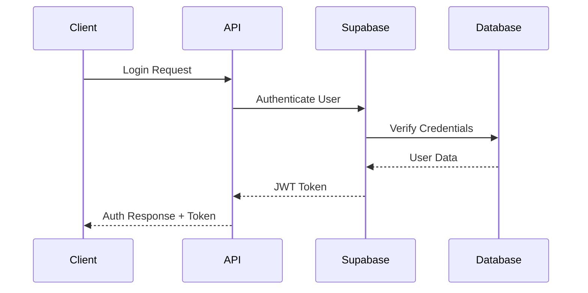

# Infinity Academy - API Documentation

## 🌐 API Overview

The Infinity Academy API is designed to provide secure, role-based access to educational data and functionality. The API follows RESTful principles and uses Supabase as the backend service.

## 🔐 Authentication

### Authentication Flow



### JWT Token Structure

```json
{
  "header": {
    "alg": "HS256",
    "typ": "JWT"
  },
  "payload": {
    "sub": "user-uuid",
    "email": "user@example.com",
    "role": "student|tutor|parent|admin",
    "iat": 1640995200,
    "exp": 1641081600
  }
}
```

### Authorization Headers

```http
Authorization: Bearer <jwt-token>
Content-Type: application/json
```

## 📚 API Endpoints

### Base URL

```
Production: https://api.infinityacademy.com
Development: http://localhost:3000/api
```

### Authentication Endpoints

#### POST /api/auth/login

Authenticate user and return JWT token.

**Request Body:**

```json
{
  "email": "user@example.com",
  "password": "securepassword"
}
```

**Response:**

```json
{
  "success": true,
  "token": "eyJhbGciOiJIUzI1NiIsInR5cCI6IkpXVCJ9...",
  "user": {
    "id": "uuid",
    "email": "user@example.com",
    "role": "student",
    "profile": {
      "firstName": "John",
      "lastName": "Doe"
    }
  }
}
```

#### POST /api/auth/register

Register new user account.

**Request Body:**

```json
{
  "email": "newuser@example.com",
  "password": "securepassword",
  "role": "student",
  "profile": {
    "firstName": "Jane",
    "lastName": "Smith",
    "dateOfBirth": "2005-03-15"
  }
}
```

#### POST /api/auth/logout

Invalidate current session.

**Headers:**

```http
Authorization: Bearer <jwt-token>
```

**Response:**

```json
{
  "success": true,
  "message": "Successfully logged out"
}
```

#### POST /api/auth/refresh

Refresh expired JWT token.

**Headers:**

```http
Authorization: Bearer <expired-jwt-token>
```

**Response:**

```json
{
  "success": true,
  "token": "eyJhbGciOiJIUzI1NiIsInR5cCI6IkpXVCJ9...",
  "expiresAt": "2024-01-01T12:00:00Z"
}
```

### User Management Endpoints

#### GET /api/users/profile

Get current user profile.

**Headers:**

```http
Authorization: Bearer <jwt-token>
```

**Response:**

```json
{
  "success": true,
  "user": {
    "id": "uuid",
    "email": "user@example.com",
    "role": "student",
    "profile": {
      "firstName": "John",
      "lastName": "Doe",
      "dateOfBirth": "2005-03-15",
      "grade": "10th",
      "school": "Infinity Academy"
    },
    "createdAt": "2024-01-01T00:00:00Z",
    "updatedAt": "2024-01-01T00:00:00Z"
  }
}
```

#### PUT /api/users/profile

Update current user profile.

**Headers:**

```http
Authorization: Bearer <jwt-token>
```

**Request Body:**

```json
{
  "profile": {
    "firstName": "John",
    "lastName": "Doe",
    "grade": "11th",
    "school": "Infinity Academy"
  }
}
```

#### GET /api/users/{id}

Get user by ID (admin only).

**Headers:**

```http
Authorization: Bearer <admin-jwt-token>
```

**Response:**

```json
{
  "success": true,
  "user": {
    "id": "uuid",
    "email": "user@example.com",
    "role": "student",
    "profile": {
      "firstName": "John",
      "lastName": "Doe"
    },
    "createdAt": "2024-01-01T00:00:00Z"
  }
}
```

### Lesson Management Endpoints

#### GET /api/lessons

Get lessons for current user.

**Headers:**

```http
Authorization: Bearer <jwt-token>
```

**Query Parameters:**

```
?startDate=2024-01-01&endDate=2024-01-31&status=scheduled
```

**Response:**

```json
{
  "success": true,
  "lessons": [
    {
      "id": "uuid",
      "title": "Math Tutoring",
      "subject": "Mathematics",
      "startTime": "2024-01-15T14:00:00Z",
      "endTime": "2024-01-15T15:00:00Z",
      "status": "scheduled",
      "student": {
        "id": "student-uuid",
        "firstName": "John",
        "lastName": "Doe"
      },
      "tutor": {
        "id": "tutor-uuid",
        "firstName": "Dr. Smith",
        "lastName": "Johnson"
      },
      "createdAt": "2024-01-01T00:00:00Z"
    }
  ],
  "pagination": {
    "page": 1,
    "limit": 20,
    "total": 1,
    "totalPages": 1
  }
}
```

#### POST /api/lessons

Create new lesson (tutor/admin only).

**Headers:**

```http
Authorization: Bearer <tutor-jwt-token>
```

**Request Body:**

```json
{
  "title": "Advanced Calculus",
  "subject": "Mathematics",
  "startTime": "2024-01-20T14:00:00Z",
  "endTime": "2024-01-20T15:00:00Z",
  "studentId": "student-uuid",
  "description": "Covering derivatives and integrals"
}
```

#### PUT /api/lessons/{id}

Update lesson details.

**Headers:**

```http
Authorization: Bearer <jwt-token>
```

**Request Body:**

```json
{
  "title": "Advanced Calculus - Updated",
  "startTime": "2024-01-20T15:00:00Z",
  "endTime": "2024-01-20T16:00:00Z"
}
```

#### DELETE /api/lessons/{id}

Cancel lesson.

**Headers:**

```http
Authorization: Bearer <jwt-token>
```

**Response:**

```json
{
  "success": true,
  "message": "Lesson cancelled successfully"
}
```

### Homework Management Endpoints

#### GET /api/homework

Get homework assignments for current user.

**Headers:**

```http
Authorization: Bearer <jwt-token>
```

**Query Parameters:**

```
?status=assigned&dueDate=2024-01-31&subject=Mathematics
```

**Response:**

```json
{
  "success": true,
  "homework": [
    {
      "id": "uuid",
      "title": "Calculus Problem Set",
      "description": "Complete problems 1-20 in Chapter 3",
      "subject": "Mathematics",
      "dueDate": "2024-01-31T23:59:59Z",
      "status": "assigned",
      "coinsReward": 50,
      "assignedBy": {
        "id": "tutor-uuid",
        "firstName": "Dr. Smith",
        "lastName": "Johnson"
      },
      "assignedTo": {
        "id": "student-uuid",
        "firstName": "John",
        "lastName": "Doe"
      },
      "createdAt": "2024-01-01T00:00:00Z"
    }
  ]
}
```

#### POST /api/homework

Assign homework (tutor/admin only).

**Headers:**

```http
Authorization: Bearer <tutor-jwt-token>
```

**Request Body:**

```json
{
  "title": "Physics Lab Report",
  "description": "Write a report on the pendulum experiment",
  "subject": "Physics",
  "dueDate": "2024-02-15T23:59:59Z",
  "studentId": "student-uuid",
  "coinsReward": 75
}
```

#### PUT /api/homework/{id}/submit

Submit homework completion.

**Headers:**

```http
Authorization: Bearer <student-jwt-token>
```

**Request Body:**

```json
{
  "submission": "Completed lab report attached",
  "attachments": ["report.pdf", "data.xlsx"]
}
```

#### PUT /api/homework/{id}/grade

Grade homework (tutor/admin only).

**Headers:**

```http
Authorization: Bearer <tutor-jwt-token>
```

**Request Body:**

```json
{
  "grade": "A",
  "feedback": "Excellent work! Clear methodology and thorough analysis.",
  "coinsAwarded": 75
}
```

### Communication Endpoints

#### GET /api/chat/conversations

Get chat conversations for current user.

**Headers:**

```http
Authorization: Bearer <jwt-token>
```

**Response:**

```json
{
  "success": true,
  "conversations": [
    {
      "id": "uuid",
      "participants": [
        {
          "id": "user-uuid",
          "firstName": "John",
          "lastName": "Doe",
          "role": "student"
        },
        {
          "id": "tutor-uuid",
          "firstName": "Dr. Smith",
          "lastName": "Johnson",
          "role": "tutor"
        }
      ],
      "lastMessage": {
        "content": "When is our next lesson?",
        "timestamp": "2024-01-15T10:30:00Z",
        "sender": "student-uuid"
      },
      "unreadCount": 2
    }
  ]
}
```

#### GET /api/chat/conversations/{id}/messages

Get messages in a conversation.

**Headers:**

```http
Authorization: Bearer <jwt-token>
```

**Query Parameters:**

```
?limit=50&before=2024-01-15T10:30:00Z
```

**Response:**

```json
{
  "success": true,
  "messages": [
    {
      "id": "uuid",
      "content": "Hello! How can I help you today?",
      "sender": {
        "id": "tutor-uuid",
        "firstName": "Dr. Smith",
        "lastName": "Johnson"
      },
      "timestamp": "2024-01-15T10:00:00Z",
      "type": "text"
    }
  ]
}
```

#### POST /api/chat/conversations/{id}/messages

Send message in conversation.

**Headers:**

```http
Authorization: Bearer <jwt-token>
```

**Request Body:**

```json
{
  "content": "I have a question about the homework",
  "type": "text"
}
```

### Analytics Endpoints

#### GET /api/analytics/student/{id}

Get student performance analytics.

**Headers:**

```http
Authorization: Bearer <jwt-token>
```

**Response:**

```json
{
  "success": true,
  "analytics": {
    "student": {
      "id": "uuid",
      "firstName": "John",
      "lastName": "Doe"
    },
    "performance": {
      "totalLessons": 45,
      "completedLessons": 42,
      "attendanceRate": 93.3,
      "averageGrade": "B+",
      "totalCoins": 1250
    },
    "subjects": [
      {
        "name": "Mathematics",
        "lessons": 20,
        "averageGrade": "A-",
        "improvement": "+15%"
      }
    ],
    "recentActivity": [
      {
        "type": "homework_completed",
        "description": "Calculus Problem Set",
        "timestamp": "2024-01-15T14:30:00Z",
        "coinsEarned": 50
      }
    ]
  }
}
```

#### GET /api/analytics/tutor/{id}

Get tutor performance analytics.

**Headers:**

```http
Authorization: Bearer <jwt-token>
```

**Response:**

```json
{
  "success": true,
  "analytics": {
    "tutor": {
      "id": "uuid",
      "firstName": "Dr. Smith",
      "lastName": "Johnson"
    },
    "performance": {
      "totalStudents": 12,
      "totalLessons": 156,
      "averageRating": 4.8,
      "totalEarnings": 3120.5
    },
    "subjects": [
      {
        "name": "Mathematics",
        "students": 8,
        "lessons": 89,
        "averageRating": 4.9
      }
    ]
  }
}
```

## 📊 Data Models

### User Model

```typescript
interface User {
  id: string;
  email: string;
  role: "student" | "tutor" | "parent" | "admin";
  profile: UserProfile;
  createdAt: string;
  updatedAt: string;
}

interface UserProfile {
  firstName: string;
  lastName: string;
  dateOfBirth?: string;
  grade?: string;
  school?: string;
  subjects?: string[];
  bio?: string;
  avatar?: string;
}
```

### Lesson Model

```typescript
interface Lesson {
  id: string;
  title: string;
  subject: string;
  startTime: string;
  endTime: string;
  status: "scheduled" | "in-progress" | "completed" | "cancelled";
  student: User;
  tutor: User;
  description?: string;
  notes?: string;
  createdAt: string;
  updatedAt: string;
}
```

### Homework Model

```typescript
interface Homework {
  id: string;
  title: string;
  description: string;
  subject: string;
  dueDate: string;
  status: "assigned" | "submitted" | "graded" | "overdue";
  coinsReward: number;
  assignedBy: User;
  assignedTo: User;
  submission?: HomeworkSubmission;
  grade?: string;
  feedback?: string;
  coinsAwarded?: number;
  createdAt: string;
  updatedAt: string;
}

interface HomeworkSubmission {
  content: string;
  attachments: string[];
  submittedAt: string;
}
```

### Message Model

```typescript
interface Message {
  id: string;
  conversationId: string;
  content: string;
  sender: User;
  timestamp: string;
  type: "text" | "image" | "file" | "system";
  readBy: string[];
}
```

## 🚨 Error Handling

### Error Response Format

```json
{
  "success": false,
  "error": {
    "code": "VALIDATION_ERROR",
    "message": "Invalid input data",
    "details": [
      {
        "field": "email",
        "message": "Email is required"
      }
    ]
  }
}
```

### Common Error Codes

- `AUTHENTICATION_ERROR`: Invalid or expired token
- `AUTHORIZATION_ERROR`: Insufficient permissions
- `VALIDATION_ERROR`: Invalid request data
- `NOT_FOUND`: Resource not found
- `CONFLICT`: Resource already exists
- `RATE_LIMIT_EXCEEDED`: Too many requests
- `INTERNAL_SERVER_ERROR`: Server error

### HTTP Status Codes

- `200`: Success
- `201`: Created
- `400`: Bad Request
- `401`: Unauthorized
- `403`: Forbidden
- `404`: Not Found
- `409`: Conflict
- `429`: Too Many Requests
- `500`: Internal Server Error

## 🔒 Rate Limiting

### Rate Limit Rules

- **Authentication endpoints**: 5 requests per minute
- **General API endpoints**: 100 requests per minute
- **File uploads**: 10 requests per minute
- **Analytics endpoints**: 20 requests per minute

### Rate Limit Headers

```http
X-RateLimit-Limit: 100
X-RateLimit-Remaining: 95
X-RateLimit-Reset: 1640995200
```

## 📝 API Versioning

### Version Header

```http
Accept: application/vnd.infinityacademy.v1+json
```

### Current Version

- **v1**: Current stable API version
- **v2**: Planned future version with breaking changes

## 🧪 Testing

### Test Environment

```
Base URL: https://staging-api.infinityacademy.com
Test Database: Separate test instance
Mock Data: Pre-populated test users and content
```

### Test Credentials

```json
{
  "student": {
    "email": "test.student@infinityacademy.com",
    "password": "testpass123"
  },
  "tutor": {
    "email": "test.tutor@infinityacademy.com",
    "password": "testpass123"
  },
  "admin": {
    "email": "test.admin@infinityacademy.com",
    "password": "testpass123"
  }
}
```

## 📚 SDKs and Libraries

### Official SDKs

- **JavaScript/TypeScript**: `@infinityacademy/sdk`
- **React**: `@infinityacademy/react`
- **Python**: `infinityacademy-python`
- **Mobile**: `@infinityacademy/mobile`

### Community Libraries

- **PHP**: `infinityacademy-php`
- **Ruby**: `infinityacademy-ruby`
- **Go**: `infinityacademy-go`

---

This API documentation provides comprehensive information about the Infinity Academy API endpoints, data models, and integration patterns. For additional support or questions, please refer to the developer portal or contact the development team.
